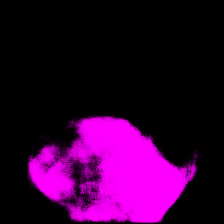

This is my attempt to implement a semantic segmentation network on darknet framework.

I implement a modified version of U-Net (https://arxiv.org/abs/1505.04597) to detect road surface.

Input to model: 224 x 224 x 3 images

Output: 224 x 224 binary label

I added a bunch of code to the darknet source files for data pre processing.

I recommend using cscope to browse through the code, makes life easier!

Sample data to train and test can be found in data/unet folder.

Feel free to adapt the code to your needs.

**Notes:**
The input images have to be reshaped to 224x224x3 (RGB) and the output label is a binary image (0's & 1's) as I only predict one class. If you want to use a different size image or multi-class prediction you need to the change the shape of input and output layer accordingly in the config file.

I normalize the image channel-wise using the mean for each channel, if you want use different normalization you have to the change the **ipl_into_image** function in the src/image.c file.

All the Unet specific code that I added to darknet has been commented with "Unet code" so you can easily track the changes.

Cheers!

Sample:

